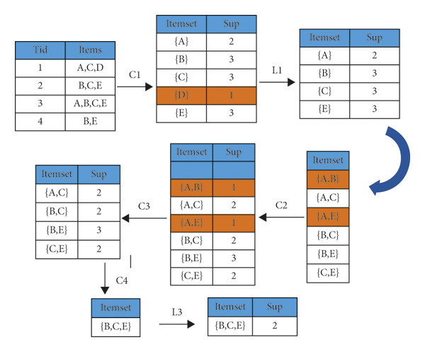

# Project 10: Market Basket Insights

**Project Title**: Market Basket Analysis

**Problem Statement**: Unveiling Customer Behaviour through Association Analysis: Utilize market basket analysis on the provided dataset to uncover hidden patterns and associations between products, aiming to understand customer purchasing behaviour and identify potential cross-selling opportunities for the retail business.

## Algorithms used in market basket analysis:

Market basket analysis utilizes association rule ***{IF} - > {THEN}*** to predict the probability of certain products being purchased together. They count the item frequency occurring together and seek to find associations that occur more than expected.

> Some algorithms that leverage these association rules are AIS, Apriori, and SETM.

Apriori is the commonly cited algorithm by the data scientist that identifies frequent items in the database. It is useful for unsupervised learning and requires no training and thus no predictions. This algorithm is used especially for large data sets where useful relationships among the items are to be determined.
You would be surprised to know that Apriori algorithm leverages a shortcut namely Apriori property. This shortcut states that all items in a frequent itemset must also be frequent. It helps in saving a lot of computational time.



The Apriori algorithm works in two steps that are illustrated below.

```
1.It identifies the itemsets systematically that occur frequently in the dataset and support greater than the pre-specified threshold value.
2.Next, it calculates the confidence of all possible rules. However, it only keeps those items states that have confidence greater than a pre-specified threshold.
```
### It is further classified into three components.
```
- Support
- Lift
- Confidence
```
## How does market basket analysis work?

Market basket analysis is based on association rule mining which is ```IF {}, THEN {} construct```

## Example

1. Import the necessary libraries

```
import numpy as np
import pandas as pd
import matplotlib.pyplot as plt
import seaborn as sns
from apyori import apriori
from mlxtend.frequent_patterns import apriori
from mlxtend.frequent_patterns import association_rules
```

2. Data preprocessing

```
mba_data = pd.read_excel("mba.xlsx")
```

3. To see the Header of dataset:
   
```
# head of datasets
print(mba_data.head())
```

4. To remove missing & duplicate values:

```
missing_values = mba_data['BillNo'].isnull().sum()
duplicate_values = mba_data['BillNo'].duplicated().sum()
print(f"Missing values in 'BillNo' column: {missing_values}")
print(f"Duplicate values in 'BillNo' column: {duplicate_values}")
mba_data_cleaned = mba_data.dropna(subset=['BillNo']).drop_duplicates(subset=['BillNo'])
# Save the cleaned dataset to a new CSV file
mba_data_cleaned.to_csv("cleaned_mba.csv", index=False)
print("Cleaned dataset saved as 'cleaned_mba.csv'")
```

5. Combine All Sets of Data to Determine the Date with the Highest Sales:

```
date_sales = mba_data.groupby('Date')['Price'].sum()
date_with_highest_sales = date_sales.idxmax()
print(f"The date with the highest sales is {date_with_highest_sales} with a total sales of {date_sales.max()}")
```

6. Determine Which Country has the Highest Sales:

```
country_sales = mba_data.groupby('Country')['Price'].sum()
country_with_highest_sales = country_sales.idxmax()
print(f"The country with the highest sales is {country_with_highest_sales} with a total sales of {country_sales.max()}")
```

7. Display Which Item has the Highest Sale using the Quantity Column:

```
item_sales = mba_data.groupby('Itemname')['Quantity'].sum()
sorted_items = item_sales.sort_values(ascending=False)
plt.figure(figsize=(10, 6))
plt.bar(sorted_items.index, sorted_items)
plt.xlabel('Item Names')
plt.ylabel('Totally Sold by Value')
plt.title('Items with Highest Sales (by Quantity)')
plt.xticks(rotation=100)
plt.show()
```
